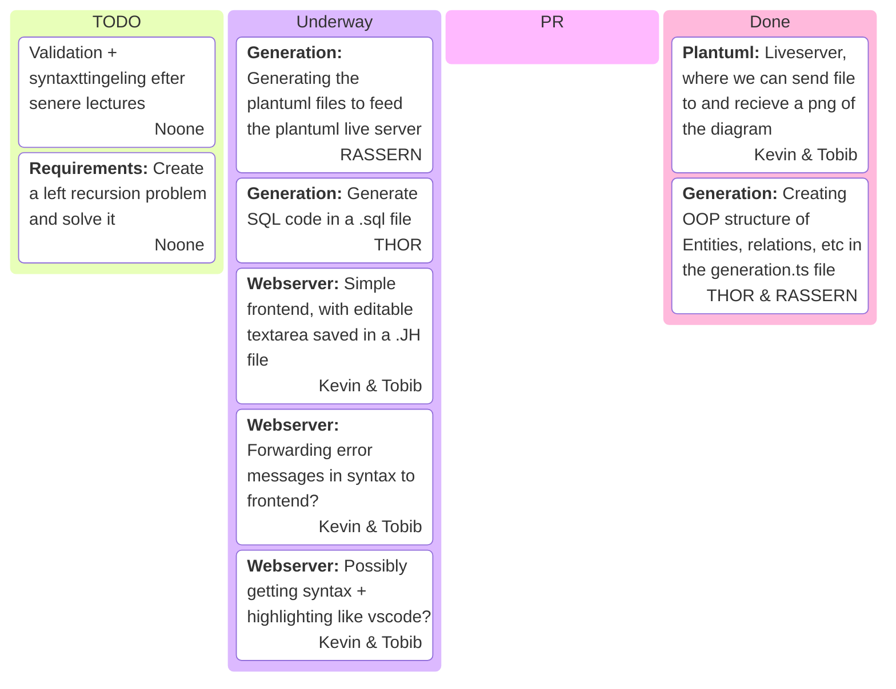

## Added features
- Validator to ensure entities have a singular parent.

## Housekeeping
Before we are done we should change the option `noUnusedLocals` back to `true` in `tsconfig.json`.

## More types
We need to support serial in the language as well

# Validation tasks:     
**TOBIAS:**
1. Check that attributes only has one key
2. Check that keywords are not defined twice (i.e. (PK Derived derived age))
3. Softvalidator (diagram is generated) but it suggest that datatypes should be on each attribute, because sql needs it.   
4. Check if varchar number is between 0 and 255 

**KEVIN**       
1. Check if RelationshipIdentifier is using a valid int (It is valid if a relationship exists that has that int as its identifier)
2. Check if Relationships have unique identifiers.
3. Check if an entity is a part of the relationship, if a user writes (entity is identified by <relationship_identifier>)
4. Upper cardinality must be larger than lower cardinality

**PERSON_Y:**       
1. Check that you cannot specify inheritance type a second time.      
2. Check if inheritancetype is declared for occurences of inheritance with more than 1 child. 
3. Inheritance with only one child, must not be able to define disjoint or overlapping.

**PERSON_Z:**       
1. Check if entities have a singular parent? ("I don't really understand this one" - Tobias)
2. Check for cross inheritance, this is not allowed
3. Check for self-inheritance, this is not allowed.

# Scoping tasks:       
**PERSON_X:** Make it possible to write: "<entity> requires <attribute> <boolean_operator> equation

**PERSON_Y:** Make it impossible to define attributes on entities, which are already defined by its parent (using scoping)

**KEVIN:** Make it possible to overwrite attribute types for inherited attributes using: "<entity> overwrite type <attribute> <type>

**TOBIAS:** Make it possible to remove an inherinted attribute from an entity: "remove attribute <attribute> from <entity>

# Testing tasks:
Tasks are not defined, as this is written prior to the lecture.

