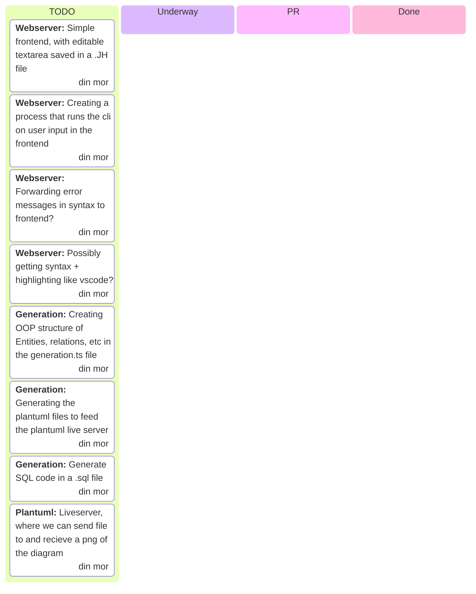

```mermaid
kanban
    column1[TODO]
        task1[**Webserver:** Simple frontend, with editable textarea saved in a .JH file]@{assigned: din mor}
        task7[**Webserver:** Creating a process that runs the cli on user input in the frontend]@{assigned: din mor}
        task8[**Webserver:** Forwarding error messages in syntax to frontend?]@{assigned: din mor}
        task2[**Webserver:** Possibly getting syntax + highlighting like vscode?]@{assigned: din mor}
        task4[**Generation:** Creating OOP structure of Entities, relations, etc in the generation.ts file]@{assigned: din mor}
        task5[**Generation:** Generating the plantuml files to feed the plantuml live server]@{assigned: din mor}
        task6[**Generation:** Generate SQL code in a .sql file]@{assigned: din mor}
        task3[**Plantuml:** Liveserver, where we can send file to and recieve a png of the diagram]@{assigned: din mor}
    column2[Underway]
    column3[PR]
    column4[Done]
        

```

