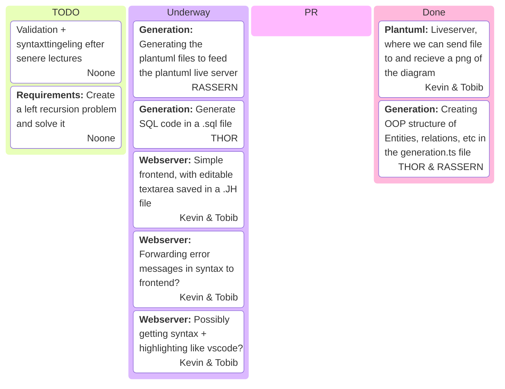

## Added features
- Validator to ensure entities have a singular parent.

## Housekeeping
Before we are done we should change the option `noUnusedLocals` back to `true` in `tsconfig.json`.

## More types
We need to support serial in the language as well