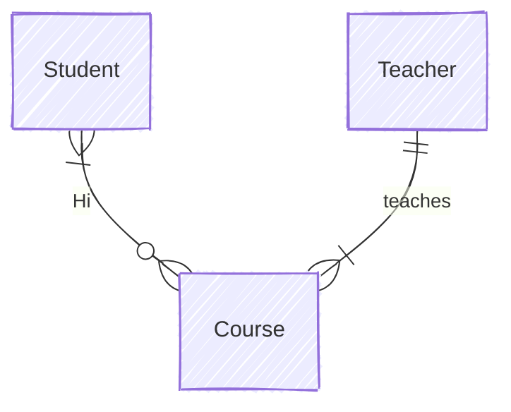

%%{init: {"theme": "forest", "themeCSS": [
    ".er.relationshipLabelBox {fill: white; border: 2px solid black; clip-path: polygon(50% 0%, 100% 50%, 50% 100%, 0% 50%); transform: scale(1);}",
    "[id*=entity-Student] .er.relationshipLabel { fill: orange;}",
    "[id*=entity-Teacher] .er.relationshipLabel { fill: orange;}",
    "[id*=entity-Course] .er.relationshipLabel { fill: orange;}"
  ]}}%%

