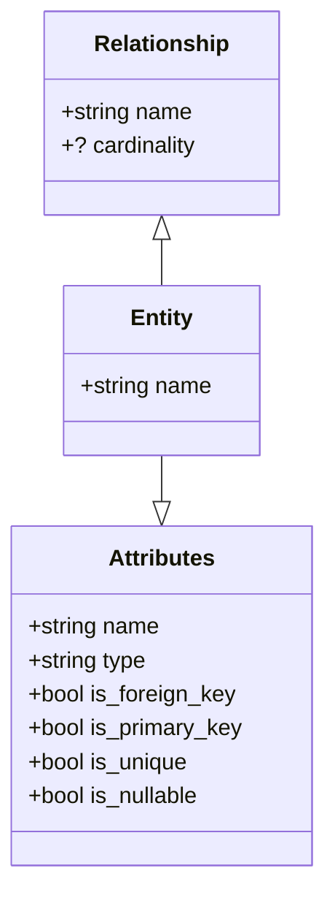

```mermaid
classDiagram

    Entity --|> Attributes
    Relationship <|-- Entity

    class Attributes{
        +string name
        +string type
        +bool is_foreign_key
        +bool is_primary_key
        +bool is_unique
        +bool is_nullable
    }

    class Entity{
        +string name
    }

    class Relationship{
        +string name
        +? cardinality
    }

```  