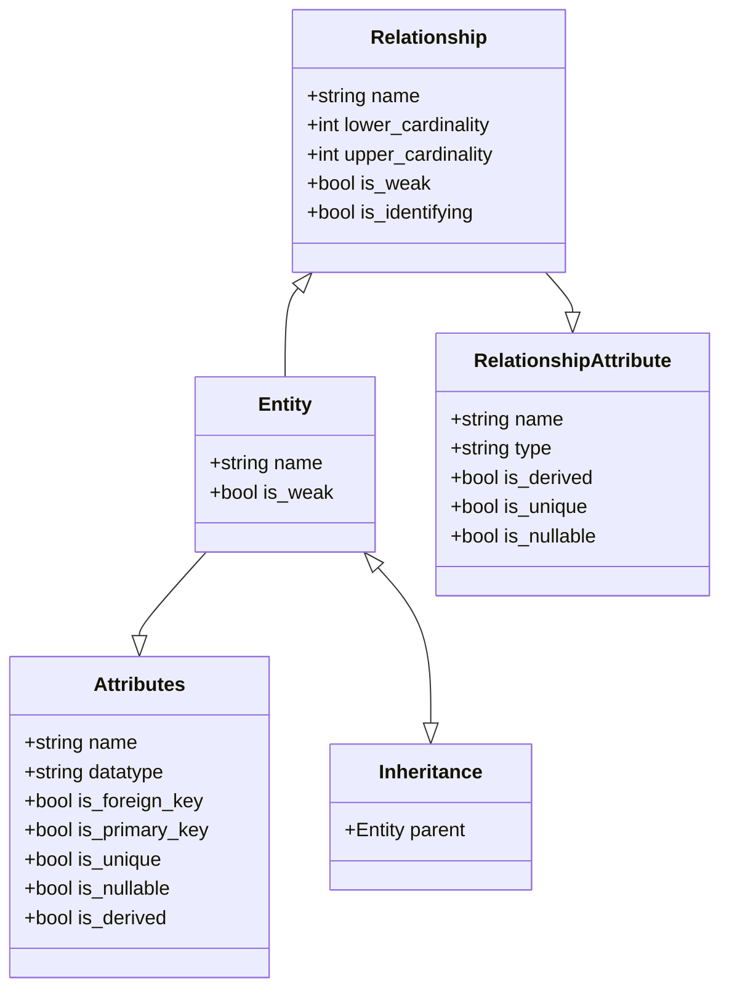

```mermaid
classDiagram

    Entity --|> Attributes
    Relationship <|-- Entity
    Relationship --|> RelationshipAttribute
    Entity <|--|> Inheritance

    class Attributes{
        +string name
        +string datatype
        +bool is_foreign_key
        +bool is_primary_key
        +bool is_unique
        +bool is_nullable
        +bool is_derived
    }

    class Entity{
        +string name
        +bool is_weak
    }

    class Relationship{
        +string name
        +int lower_cardinality
        +int upper_cardinality
        +bool is_weak
        +bool is_identifying
    }

    class RelationshipAttribute{
        +string name
        +string type
        +bool is_derived
        +bool is_unique
        +bool is_nullable
    }

    class Inheritance{
        +Entity parent
    }

```  